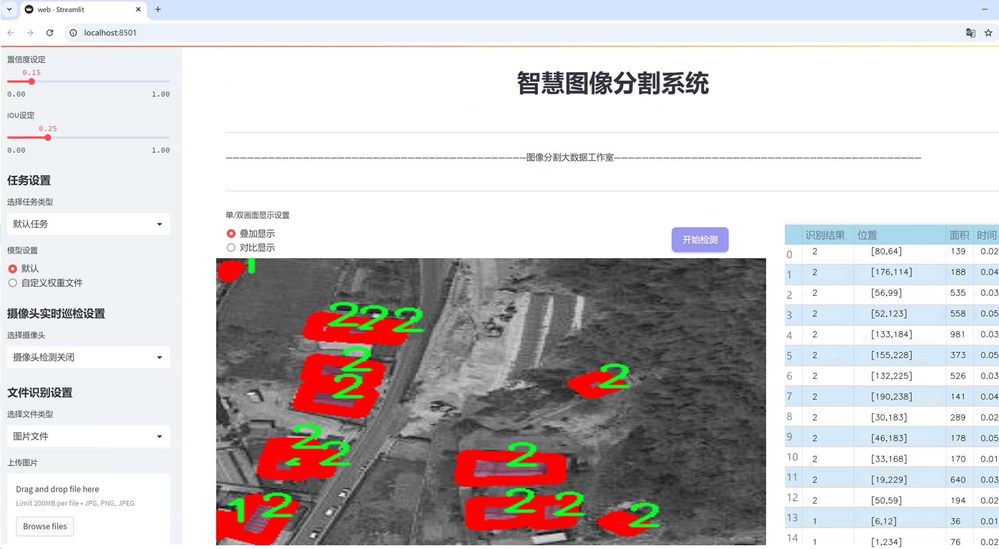
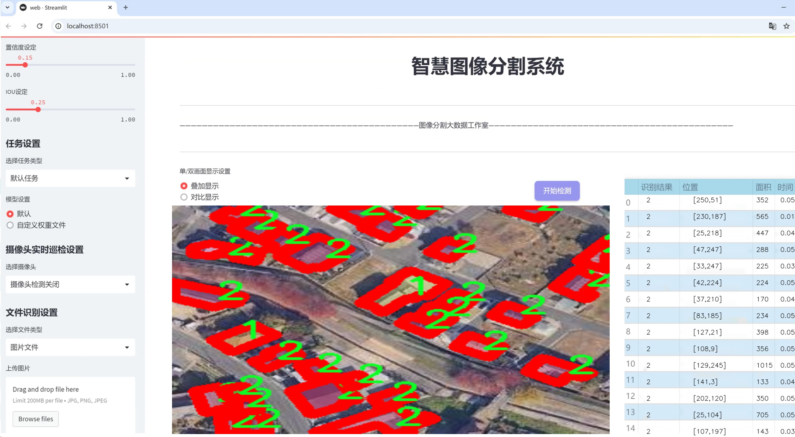
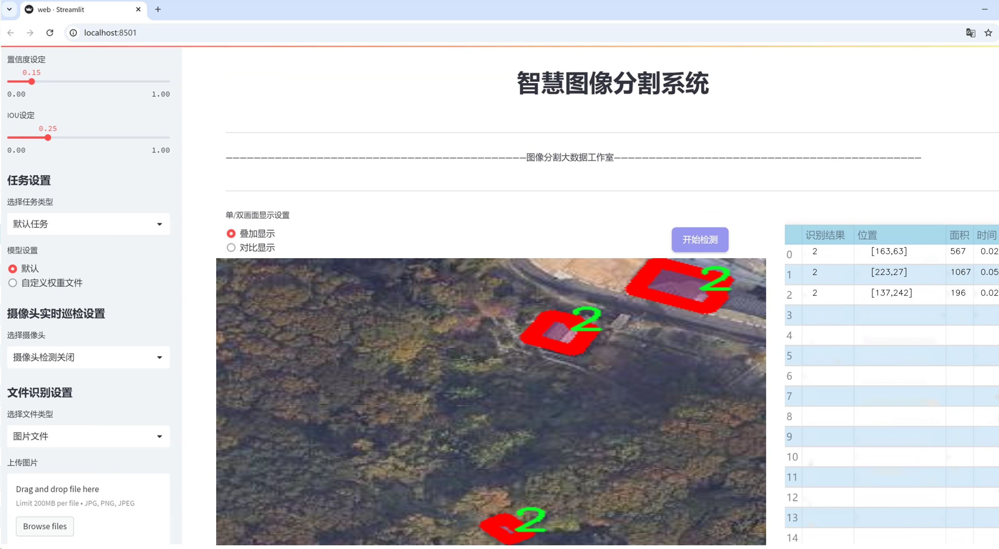
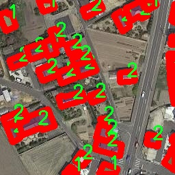
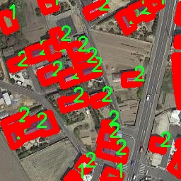
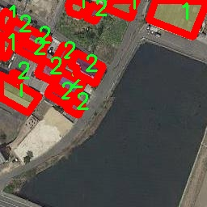
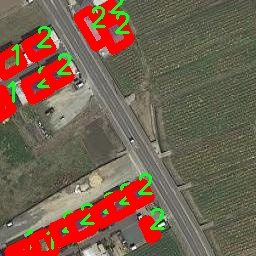
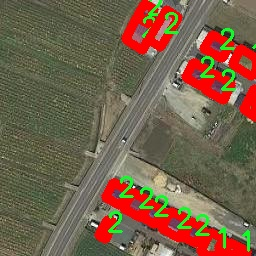

# 屋顶图像分割系统源码＆数据集分享
 [yolov8-seg-C2f-Parc＆yolov8-seg-vanillanet等50+全套改进创新点发刊_一键训练教程_Web前端展示]

### 1.研究背景与意义

项目参考[ILSVRC ImageNet Large Scale Visual Recognition Challenge](https://gitee.com/YOLOv8_YOLOv11_Segmentation_Studio/projects)

项目来源[AAAI Global Al lnnovation Contest](https://kdocs.cn/l/cszuIiCKVNis)

研究背景与意义

随着城市化进程的加快，屋顶作为建筑的重要组成部分，其形态、材料及功能的多样性使得屋顶图像的分析与处理成为了计算机视觉领域的重要研究方向。屋顶图像分割不仅在建筑设计、城市规划中具有重要应用价值，同时也为环境监测、灾害评估等提供了有效的技术支持。近年来，深度学习技术的迅猛发展，尤其是目标检测与图像分割领域的进步，为屋顶图像的自动化分析提供了新的机遇。其中，YOLO（You Only Look Once）系列模型因其高效的实时检测能力而受到广泛关注，尤其是YOLOv8的推出，更是为图像分割任务提供了更为强大的技术基础。

本研究旨在基于改进的YOLOv8模型，构建一个高效的屋顶图像分割系统。我们所使用的数据集包含2900张屋顶图像，涵盖了四个类别，包括三种屋顶类型和背景类。这一数据集的构建不仅为模型的训练提供了丰富的样本，同时也为后续的性能评估奠定了基础。通过对不同屋顶类型的有效分割，我们能够更好地理解屋顶的结构特征与功能属性，从而为相关领域的研究提供数据支持。

在当前的研究中，屋顶图像分割面临着诸多挑战，如复杂的背景、不同的光照条件以及屋顶形态的多样性等。传统的图像处理方法往往难以应对这些复杂性，而基于深度学习的图像分割技术则展现出了优越的性能。YOLOv8模型在处理实时性和准确性方面的优势，使其成为解决屋顶图像分割问题的理想选择。通过对YOLOv8模型的改进，我们期望在分割精度和处理速度上实现更好的平衡，从而提升屋顶图像分析的效率。

此外，屋顶图像分割的研究不仅具有学术价值，也具有重要的社会意义。随着气候变化和城市热岛效应的加剧，屋顶的设计与材料选择对城市环境的影响日益显著。通过对屋顶图像的精确分割与分析，我们能够为城市规划者提供科学依据，帮助其在屋顶绿化、太阳能利用等方面做出更为合理的决策。同时，屋顶图像分割技术在灾后评估、建筑物安全检测等领域的应用，能够有效提升城市的韧性与安全性。

综上所述，基于改进YOLOv8的屋顶图像分割系统的研究，不仅能够推动计算机视觉技术的发展，也将为城市建设与管理提供切实可行的解决方案。通过本研究，我们希望能够为屋顶图像分割领域的学术研究与实际应用贡献新的思路与方法，从而促进相关领域的进一步发展。

### 2.图片演示







##### 注意：由于此博客编辑较早，上面“2.图片演示”和“3.视频演示”展示的系统图片或者视频可能为老版本，新版本在老版本的基础上升级如下：（实际效果以升级的新版本为准）

  （1）适配了YOLOV8的“目标检测”模型和“实例分割”模型，通过加载相应的权重（.pt）文件即可自适应加载模型。

  （2）支持“图片识别”、“视频识别”、“摄像头实时识别”三种识别模式。

  （3）支持“图片识别”、“视频识别”、“摄像头实时识别”三种识别结果保存导出，解决手动导出（容易卡顿出现爆内存）存在的问题，识别完自动保存结果并导出到tempDir中。

  （4）支持Web前端系统中的标题、背景图等自定义修改，后面提供修改教程。

  另外本项目提供训练的数据集和训练教程,暂不提供权重文件（best.pt）,需要您按照教程进行训练后实现图片演示和Web前端界面演示的效果。

### 3.视频演示

[3.1 视频演示](https://www.bilibili.com/video/BV1h3x9exEY2/)

### 4.数据集信息展示

##### 4.1 本项目数据集详细数据（类别数＆类别名）

nc: 3
names: ['1', '2', '3']


##### 4.2 本项目数据集信息介绍

数据集信息展示

在本研究中，我们使用了名为“roof”的数据集，旨在训练和改进YOLOv8-seg模型，以实现高效的屋顶图像分割。该数据集专门设计用于屋顶相关的图像处理任务，具有良好的代表性和多样性，能够为模型的训练提供丰富的样本支持。数据集包含三种主要类别，分别标记为‘1’，‘2’和‘3’，这些类别的选择经过精心考虑，以确保模型能够有效地识别和分割不同类型的屋顶结构。

首先，类别‘1’可能代表一种特定类型的屋顶，比如平屋顶或坡屋顶，这类屋顶在城市建筑中相对常见，具有独特的形状和结构特征。通过对这一类别的图像进行标注和训练，模型能够学习到如何识别这种屋顶的特征，如边缘、角度和表面纹理等。这对于后续的图像分割任务至关重要，因为模型需要能够准确地分离出屋顶与周围环境的界限，从而实现精确的分割效果。

类别‘2’则可能对应于另一种屋顶类型，例如瓦片屋顶或金属屋顶。这类屋顶在建筑设计中也占有重要地位，具有不同的材料和视觉效果。通过引入这一类别的数据，模型可以扩展其识别能力，适应更多样化的屋顶结构。特别是在处理复杂场景时，能够有效区分不同类型的屋顶，将有助于提高分割的准确性和鲁棒性。

最后，类别‘3’可能代表一种特殊的屋顶设计，例如绿色屋顶或太阳能屋顶。这类屋顶不仅在功能上具有特殊性，而且在视觉上也可能与传统屋顶有显著差异。通过对这一类别的学习，模型能够捕捉到更为复杂的屋顶特征，进一步提升其分割性能。这种多样化的类别设置，不仅丰富了数据集的内容，也为模型的训练提供了更为全面的视角。

在数据集的构建过程中，所有图像均经过严格的标注和筛选，以确保数据的质量和准确性。每个类别的样本数量经过精心设计，以保证模型在训练过程中能够获得均衡的学习机会。此外，数据集中的图像涵盖了不同的光照条件、视角和背景，这些因素将进一步增强模型的泛化能力，使其能够在实际应用中表现出色。

通过对“roof”数据集的深入分析和应用，我们期望能够显著提升YOLOv8-seg在屋顶图像分割任务中的表现。这不仅将推动计算机视觉领域的研究进展，也将为城市规划、建筑设计和环境监测等实际应用提供有力的技术支持。最终，我们希望通过这一研究，能够为屋顶图像的自动化处理提供一个高效、准确的解决方案，为相关领域的研究和应用开辟新的方向。











### 5.全套项目环境部署视频教程（零基础手把手教学）

[5.1 环境部署教程链接（零基础手把手教学）](https://www.bilibili.com/video/BV1jG4Ve4E9t/?vd_source=bc9aec86d164b67a7004b996143742dc)


[5.2 安装Python虚拟环境创建和依赖库安装视频教程链接（零基础手把手教学）](https://www.bilibili.com/video/BV1nA4VeYEze/?vd_source=bc9aec86d164b67a7004b996143742dc)

### 6.手把手YOLOV8-seg训练视频教程（零基础小白有手就能学会）

[6.1 手把手YOLOV8-seg训练视频教程（零基础小白有手就能学会）](https://www.bilibili.com/video/BV1cA4VeYETe/?vd_source=bc9aec86d164b67a7004b996143742dc)


按照上面的训练视频教程链接加载项目提供的数据集，运行train.py即可开始训练



     Epoch   gpu_mem       box       obj       cls    labels  img_size
     1/200     0G   0.01576   0.01955  0.007536        22      1280: 100%|██████████| 849/849 [14:42<00:00,  1.04s/it]
               Class     Images     Labels          P          R     mAP@.5 mAP@.5:.95: 100%|██████████| 213/213 [01:14<00:00,  2.87it/s]
                 all       3395      17314      0.994      0.957      0.0957      0.0843

     Epoch   gpu_mem       box       obj       cls    labels  img_size
     2/200     0G   0.01578   0.01923  0.007006        22      1280: 100%|██████████| 849/849 [14:44<00:00,  1.04s/it]
               Class     Images     Labels          P          R     mAP@.5 mAP@.5:.95: 100%|██████████| 213/213 [01:12<00:00,  2.95it/s]
                 all       3395      17314      0.996      0.956      0.0957      0.0845

     Epoch   gpu_mem       box       obj       cls    labels  img_size
     3/200     0G   0.01561    0.0191  0.006895        27      1280: 100%|██████████| 849/849 [10:56<00:00,  1.29it/s]
               Class     Images     Labels          P          R     mAP@.5 mAP@.5:.95: 100%|███████   | 187/213 [00:52<00:00,  4.04it/s]
                 all       3395      17314      0.996      0.957      0.0957      0.0845


### 7.50+种全套YOLOV8-seg创新点代码加载调参视频教程（一键加载写好的改进模型的配置文件）

[7.1 50+种全套YOLOV8-seg创新点代码加载调参视频教程（一键加载写好的改进模型的配置文件）](https://www.bilibili.com/video/BV1Hw4VePEXv/?vd_source=bc9aec86d164b67a7004b996143742dc)

### 8.YOLOV8-seg图像分割算法原理

原始YOLOV8-seg算法原理

YOLOv8-seg作为YOLO系列中的最新版本，标志着目标检测和分割技术的又一次重大进步。其核心思想是通过高效的网络结构和创新的算法设计，提升目标检测的精度和速度，同时增强对复杂场景中小目标的感知能力。YOLOv8-seg不仅延续了YOLO系列一贯的anchor-free检测方法，还在特征提取和处理流程中引入了多种新技术，以适应日益复杂的应用场景。

首先，YOLOv8-seg的网络结构主要由输入端、主干网络、Neck端和输出端四个模块组成。输入端负责对输入图像进行预处理，包括Mosaic数据增强、自适应图像缩放和灰度填充等，这些步骤旨在提升模型对不同场景和条件下的适应性。通过这些预处理技术，YOLOv8-seg能够有效地扩展训练数据集，从而提高模型的泛化能力。

在主干网络中，YOLOv8-seg采用了更深的卷积神经网络结构，结合了卷积、池化等操作，提取图像的多层次特征。与以往的YOLO版本相比，YOLOv8-seg在特征提取过程中引入了C2f和SPPF结构，这些结构通过更高效的特征提取机制，增强了模型对复杂背景和小目标的感知能力。特别是在复杂水面环境下，YOLOv8-seg能够更好地捕捉小目标漂浮物的特征，减少定位误差。

Neck端的设计是YOLOv8-seg的一大亮点。它基于路径聚合网络（PAN）结构，通过上采样、下采样和特征拼接的方式，融合不同尺度的特征图。这种特征融合策略使得YOLOv8-seg能够在多尺度上进行目标检测，进一步提升了对小目标的检测能力。此外，Neck端还引入了GSConv和Slim-neck技术，这些技术不仅保持了检测精度，还有效降低了计算量，使得YOLOv8-seg在处理复杂场景时依然能够保持高效的实时性能。

在输出端，YOLOv8-seg采用了decoupled head结构，实现了分类和回归过程的解耦。这种设计使得模型在进行目标检测时，能够更好地匹配正负样本，并进行精确的损失计算。具体而言，YOLOv8-seg使用了Task-Aligned Assigner方法，对分类分数和回归分数进行加权，从而提高了样本匹配的准确性。在损失计算方面，YOLOv8-seg采用了BCE（binary cross-entropy）计算分类损失，同时使用DFL（distribution focal loss）和CIoU（complete intersection over union）损失函数计算回归损失，这一组合进一步提升了模型的精度和鲁棒性。

然而，尽管YOLOv8-seg在多个方面进行了优化，但在复杂水面环境下，仍然面临小目标漏检和定位误差的问题。为了解决这些挑战，YOLOv8-seg的改进版本——YOLOv8-WSSOD算法应运而生。该算法在YOLOv8-seg的基础上，首先引入了BiFormer双层路由注意力机制，构建了C2fBF模块，以减轻主干网络下采样过程中的噪声影响。这一机制能够更好地保留特征提取过程中细粒度的上下文信息，从而提升模型对小目标的感知能力。

其次，YOLOv8-WSSOD在网络中添加了一个更小的检测头，专门用于提升对小目标的检测能力。这一改进使得模型在处理小目标时，能够更加敏感，减少漏检现象。此外，在Neck端的GSConv和Slim-neck技术的引入，不仅保持了模型的检测精度，还有效降低了计算量，使得YOLOv8-WSSOD在实时性和准确性之间达到了更好的平衡。

最后，YOLOv8-WSSOD还使用了MPDIoU损失函数替换了CIoU损失函数，这一变化显著提高了模型的泛化能力和精准度。MPDIoU损失函数通过考虑目标框的多个维度信息，使得模型在训练过程中能够更好地适应不同场景下的目标检测任务。

综上所述，YOLOv8-seg算法通过一系列创新的设计和技术，显著提升了目标检测的性能，尤其是在复杂环境下的小目标检测能力。尽管仍存在一些挑战，但通过不断的改进和优化，YOLOv8-seg及其衍生版本正在向更高的目标检测精度和速度迈进，展现出广阔的应用前景。随着技术的不断发展，YOLOv8-seg有望在智能监控、自动驾驶等多个领域发挥重要作用，为相关应用提供更加可靠和高效的解决方案。


### 9.系统功能展示（检测对象为举例，实际内容以本项目数据集为准）

图9.1.系统支持检测结果表格显示

  图9.2.系统支持置信度和IOU阈值手动调节

  图9.3.系统支持自定义加载权重文件best.pt(需要你通过步骤5中训练获得)

  图9.4.系统支持摄像头实时识别

  图9.5.系统支持图片识别

  图9.6.系统支持视频识别

  图9.7.系统支持识别结果文件自动保存

  图9.8.系统支持Excel导出检测结果数据


### 10.50+种全套YOLOV8-seg创新点原理讲解（非科班也可以轻松写刊发刊，V11版本正在科研待更新）

#### 10.1 由于篇幅限制，每个创新点的具体原理讲解就不一一展开，具体见下列网址中的创新点对应子项目的技术原理博客网址【Blog】：


[10.1 50+种全套YOLOV8-seg创新点原理讲解链接](https://gitee.com/qunmasj/good)

#### 10.2 部分改进模块原理讲解(完整的改进原理见上图和技术博客链接)
### 深度学习基础
卷积神经网络通过使用具有共享参数的卷积运算显著降低了模型的计算开销和复杂性。在LeNet、AlexNet和VGG等经典网络的驱动下，卷积神经网络现在已经建立了一个完整的系统，并在深度学习领域形成了先进的卷积神经网络模型。

感受野注意力卷积RFCBAMConv的作者在仔细研究了卷积运算之后获得了灵感。对于分类、目标检测和语义分割任务，一方面，图像中不同位置的对象的形状、大小、颜色和分布是可变的。在卷积操作期间，卷积核在每个感受野中使用相同的参数来提取信息，而不考虑来自不同位置的差分信息。这限制了网络的性能，这已经在最近的许多工作中得到了证实。

另一方面，卷积运算没有考虑每个特征的重要性，这进一步影响了提取特征的有效性，并最终限制了模型的性能。此外，注意力机制允许模型专注于重要特征，这可以增强特征提取的优势和卷积神经网络捕获详细特征信息的能力。因此，注意力机制在深度学习中得到了广泛的应用，并成功地应用于各个领域。

通过研究卷积运算的内在缺陷和注意力机制的特点，作者认为现有的空间注意力机制从本质上解决了卷积运算的参数共享问题，但仍局限于对空间特征的认知。对于较大的卷积核，现有的空间注意力机制并没有完全解决共享参数的问题。此外，他们无法强调感受野中每个特征的重要性，例如现有的卷积块注意力模块（CBAM）和 Coordinate注意力（CA）。

因此，[参考该博客提出了一种新的感受野注意力机制（RFA）](https://qunmasj.com)，它完全解决了卷积核共享参数的问题，并充分考虑了感受野中每个特征的重要性。通过RFA设计的卷积运算（RFAConv）是一种新的卷积运算，可以取代现有神经网络中的标准卷积运算。RFAConv通过添加一些参数和计算开销来提高网络性能。

大量关于Imagnet-1k、MS COCO和VOC的实验已经证明了RFAConv的有效性。作为一种由注意力构建的新型卷积运算，它超过了由CAM、CBAM和CA构建的卷积运算（CAMConv、CBAMConv、CAConv）以及标准卷积运算。

此外，为了解决现有方法提取感受野特征速度慢的问题，提出了一种轻量级操作。在构建RFAConv的过程中，再次设计了CA和CBAM的升级版本，并进行了相关实验。作者认为当前的空间注意力机制应该将注意力放在感受野空间特征上，以促进当前空间注意力机制的发展，并再次增强卷积神经网络架构的优势。


### 卷积神经网络架构
出色的神经网络架构可以提高不同任务的性能。卷积运算作为卷积神经网络的一种基本运算，推动了人工智能的发展，并为车辆检测、无人机图像、医学等先进的网络模型做出了贡献。He等人认为随着网络深度的增加，该模型将变得难以训练并产生退化现象，因此他们提出了残差连接来创新卷积神经网络架构的设计。Huang等人通过重用特征来解决网络梯度消失问题，增强了特征信息，他们再次创新了卷积神经网络架构。

通过对卷积运算的详细研究，Dai等人认为，具有固定采样位置的卷积运算在一定程度上限制了网络的性能，因此提出了Deformable Conv，通过学习偏移来改变卷积核的采样位置。在Deformable Conv的基础上，再次提出了Deformable Conv V2和Deformable Conv V3，以提高卷积网络的性能。

Zhang等人注意到，组卷积可以减少模型的参数数量和计算开销。然而，少于组内信息的交互将影响最终的网络性能。1×1的卷积可以与信息相互作用。然而，这将带来更多的参数和计算开销，因此他们提出了无参数的“通道Shuffle”操作来与组之间的信息交互。

Ma等人通过实验得出结论，对于参数较少的模型，推理速度不一定更快，对于计算量较小的模型，推理也不一定更快。经过仔细研究提出了Shufflenet V2。

YOLO将输入图像划分为网格，以预测对象的位置和类别。经过不断的研究，已经提出了8个版本的基于YOLO的目标检测器，如YOLOv5、YOLOv7、YOLOv8等。上述卷积神经网络架构已经取得了巨大的成功。然而，它们并没有解决提取特征过程中的参数共享问题。本文的工作从注意力机制开始，从一个新的角度解决卷积参数共享问题。

### 注意力机制
注意力机制被用作一种提高网络模型性能的技术，使其能够专注于关键特性。注意力机制理论已经在深度学习中建立了一个完整而成熟的体系。Hu等人提出了一种Squeeze-and-Excitation（SE）块，通过压缩特征来聚合全局通道信息，从而获得与每个通道对应的权重。Wang等人认为，当SE与信息交互时，单个通道和权重之间的对应关系是间接的，因此设计了高效通道注Efficient Channel Attention力（ECA），并用自适应kernel大小的一维卷积取代了SE中的全连接（FC）层。Woo等人提出了卷积块注意力模块（CBAM），它结合了通道注意力和空间注意力。作为一个即插即用模块，它可以嵌入卷积神经网络中，以提高网络性能。

尽管SE和CBAM已经提高了网络的性能。Hou等人仍然发现压缩特征在SE和CBAM中丢失了太多信息。因此，他们提出了轻量级Coordinate注意力（CA）来解决SE和CBAM中的问题。Fu等人计了一个空间注意力模块和通道注意力模块，用于扩展全卷积网络（FCN），分别对空间维度和通道维度的语义相关性进行建模。Zhang等人在通道上生成不同尺度的特征图，以建立更有效的通道注意力机制。

本文从一个新的角度解决了标准卷积运算的参数共享问题。这就是将注意力机制结合起来构造卷积运算。尽管目前的注意力机制已经获得了良好的性能，但它们仍然没有关注感受野的空间特征。因此，设计了具有非共享参数的RFA卷积运算，以提高网络的性能。


#### 回顾标准卷积
以标准卷积运算为基础构建卷积神经网络，通过共享参数的滑动窗口提取特征信息，解决了全连接层构建的神经网络的固有问题（即参数数量大、计算开销高）。

设表示输入特征图，其中、和分别表示特征图的通道数、高度和宽度。为了能够清楚地展示卷积核提取特征信息的过程，以为例。提取每个感受野slider的特征信息的卷积运算可以表示如下：


这里，表示在每次卷积slider操作之后获得的值，表示在每个slider内的相应位置处的像素值。表示卷积核，表示卷积核中的参数数量，表示感受野slider的总数。

可以看出，每个slider内相同位置的特征共享相同的参数。因此，标准的卷积运算无法感知不同位置带来的差异信息，这在一定程度上限制了卷积神经网络的性能。

#### 回顾空间注意力
目前，空间注意力机制使用通过学习获得的注意力图来突出每个特征的重要性。与上一节类似，以为例。突出关键特征的空间注意力机制可以简单地表达如下：


这里，表示在加权运算之后获得的值。和分别表示输入特征图和学习注意力图在不同位置的值，是输入特征图的高度和宽度的乘积，表示像素值的总数。一般来说，整个过程可以简单地表示在图1中。


#### 空间注意力与标准卷积
众所周知，将注意力机制引入卷积神经网络可以提高网络的性能。通过标准的卷积运算和对现有空间注意力机制的仔细分析。作者认为空间注意力机制本质上解决了卷积神经网络的固有缺点，即共享参数的问题。

目前，该模型最常见的卷积核大小为1×1和3×3。引入空间注意力机制后用于提取特征的卷积操作是1×1或3×3卷积操作。这个过程可以直观地显示出来。空间注意力机制被插入到1×1卷积运算的前面。通过注意力图对输入特征图进行加权运算（Re-weight“×”），最后通过1×1卷积运算提取感受野的slider特征信息。

整个过程可以简单地表示如下：


 

这里，卷积核仅表示一个参数值。如果将的值作为一个新的卷积核参数，那么有趣的是，通过1×1卷积运算提取特征时的参数共享问题得到了解决。然而，空间注意力机制的传说到此结束。当空间注意力机制被插入到3×3卷积运算的前面时。具体情况如下：


如上所述，如果取的值。作为一种新的卷积核参数，上述方程完全解决了大规模卷积核的参数共享问题。然而，最重要的一点是，卷积核在每个感受野slider中提取将共享部分特征的特征。换句话说，在每个感受野slider内都会有重叠。

经过仔细分析发现，，…，空间注意力图的权重在每个slider内共享。因此，空间注意机制不能解决大规模卷积核共享参数的问题，因为它们不注意感受野的空间特征。在这种情况下，空间注意力机制是有限的。
#### 创新空间注意力与标准卷积
RFA是为了解决空间注意力机制问题而提出的，创新了空间注意力。使用与RFA相同的思想，一系列空间注意力机制可以再次提高性能。RFA设计的卷积运算可以被视为一种轻量级的即插即用模块，以取代标准卷积，从而提高卷积神经网络的性能。因此，作者认为空间注意力机制和标准卷积在未来将有一个新的春天。

感受野的空间特征：

现在给出感受野空间特征的定义。它是专门为卷积核设计的，并根据kernel大小动态生成，如图2所示，以3×3卷积核为例。


在图2中，“空间特征”表示原始特征图，等于空间特征。“感受野空间特征”表示变换后的特征，该特征由每个感受野slider滑块组成，并且不重叠。也就是说，“感受野空间特征”中的每个3×3大小的slider表示提取原始3×3卷积特征时所有感觉野slider的特征。

#### 感受野注意力卷积(RFA):

关于感受野空间特征，该博客的作者提出了感受野注意（RFA），它不仅强调了感受野slider内各种特征的重要性，而且还关注感受野空间特性，以彻底解决卷积核参数共享的问题。感受野空间特征是根据卷积核的大小动态生成的，因此，RFA是卷积的固定组合，不能脱离卷积运算的帮助，卷积运算同时依赖RFA来提高性能。

因此，作者提出了感受野注意力卷积（RFAConv）。具有3×3大小卷积核的RFAConv的总体结构如图3所示。


目前，提取感受野特征最常用的方法速度较慢，因此经过不断探索提出了一种快速的方法，通过分组卷积来取代原来的方法。

具体来说，根据感受野大小，使用相应的组卷积大小来动态生成展开特征。尽管与原始的无参数方法（如Pytorch提供的nn.Unfld()）相比，该方法添加了一些参数，但速度要快得多。

注意：正如在上一节中提到的，当原始的3×3卷积核提取特征时，感受野空间特征中的每个3×3大小的窗口表示所有感受野滑块的特征。但在快速分组卷积提取感受野特征后，由于原始方法太慢，它们会被映射到新的特征中。

最近的一些工作已经证明信息交互可以提高网络性能。类似地，对于RFAConv，与感受野特征信息交互以学习注意力图可以提高网络性能，但与每个感受野特征交互将带来额外的计算开销。为了确保少量的计算开销和参数数量，通过探索使用AvgPool池化每个感受野特征的全局信息，然后通过1×1组卷积运算与信息交互。最后，softmax用于强调感受野特征中每个特征的重要性。通常，RFA的计算可以表示为：


表示分组卷积，表示卷积核的大小，代表规范化，表示输入特征图，是通过将注意力图与变换的感受野空间特征相乘而获得的。

与CBAM和CA不同，RFA可以为每个感受野特征生成注意力图。标准卷积受到卷积神经网络性能的限制，因为共享参数的卷积运算对位置带来的差异信息不敏感。RFA完全可以解决这个问题，具体细节如下：


由于RFA获得的特征图是“调整形状”后不重叠的感受野空间特征，因此通过池化每个感受野滑块的特征信息来学习学习的注意力图。换句话说，RFA学习的注意力图不再在每个感受野slider内共享，并且是有效的。这完全解决了现有的CA和CBAM对大尺寸kernel的注意力机制中的参数共享问题。

同时，RFA给标准卷积核带来了相当大的好处，但调整形状后，特征的高度和宽度是k倍，需要进行k×k的stride卷积运算，才能提取特征信息。RFAConv创新了标准卷积运算。

此外，空间注意力机制将得到升级，因为作者认为现有的空间注意力机制应该专注于感受野空间特征，以提高网络的性能。众所周知，基于自注意力机制的网络模型取得了巨大的成功，因为它解决了卷积参数共享的问题，并对远程信息进行了建模，但基于自注意力机理的方法给模型带来了巨大的计算开销和复杂性。作者认为通过将一些现有空间注意力机制的注意力放在感受野空间特征中，它以轻量级的方式解决了自注意力机制的问题。

答案如下：

将关注感受野空间特征的空间注意力与卷积相匹配，完全解决了卷积参数共享的问题；

当前的空间注意力机制本身具有考虑远距离信息的特点，它们通过全局平均池化或全局最大池化来获得全局信息，这在一定程度上考虑了远距离信息。


为此，作者设计了一种新的CBAM和CA，称为RFACBAM和RFACA，它专注于感受野的空间特征。与RFA类似，使用stride为k的k×k的最终卷积运算来提取特征信息，具体结构如图4和图5所示，将这2种新的卷积方法称为RFCBAMConv和RFCAConv。比较原始的CBAM，使用SE注意力来代替RFCBAM中的CAM。因为这样可以减少计算开销。


此外，在RFCBAM中，通道和空间注意力不是在单独的步骤中执行的，因为通道和空间注意力是同时加权的，从而允许在每个通道上获得的注意力图是不同的。


### 11.项目核心源码讲解（再也不用担心看不懂代码逻辑）

#### 11.1 ui.py

以下是对代码的核心部分进行提炼和详细注释的版本：

```python
import sys
import subprocess

def run_script(script_path):
    """
    使用当前 Python 环境运行指定的脚本。

    Args:
        script_path (str): 要运行的脚本路径

    Returns:
        None
    """
    # 获取当前 Python 解释器的路径
    python_path = sys.executable

    # 构建运行命令，使用 streamlit 运行指定的脚本
    command = f'"{python_path}" -m streamlit run "{script_path}"'

    # 执行命令，并等待其完成
    result = subprocess.run(command, shell=True)
    
    # 检查命令执行的返回码，如果不为0则表示出错
    if result.returncode != 0:
        print("脚本运行出错。")

# 程序入口
if __name__ == "__main__":
    # 指定要运行的脚本路径
    script_path = "web.py"  # 这里可以直接指定脚本名称

    # 调用函数运行脚本
    run_script(script_path)
```

### 代码分析与注释：

1. **导入模块**：
   - `sys`：用于访问与 Python 解释器相关的变量和函数。
   - `subprocess`：用于执行外部命令和与其交互。

2. **`run_script` 函数**：
   - 该函数接受一个参数 `script_path`，表示要运行的 Python 脚本的路径。
   - 使用 `sys.executable` 获取当前 Python 解释器的路径，以确保使用正确的 Python 环境来运行脚本。
   - 构建命令字符串，使用 `streamlit` 模块运行指定的脚本。
   - 使用 `subprocess.run` 执行命令，并等待其完成。
   - 检查命令的返回码，如果返回码不为0，表示脚本运行出错，打印错误信息。

3. **程序入口**：
   - 使用 `if __name__ == "__main__":` 确保只有在直接运行该脚本时才会执行以下代码。
   - 指定要运行的脚本路径（这里为 `web.py`）。
   - 调用 `run_script` 函数，传入脚本路径以执行该脚本。

这个代码的核心功能是通过当前 Python 环境来运行一个指定的脚本，并在执行过程中处理可能出现的错误。

这个文件名为 `ui.py`，其主要功能是通过当前的 Python 环境来运行一个指定的脚本。文件中首先导入了必要的模块，包括 `sys`、`os` 和 `subprocess`，这些模块分别用于获取系统信息、处理文件路径和执行系统命令。

在 `run_script` 函数中，首先定义了一个参数 `script_path`，它是要运行的脚本的路径。函数内部首先获取当前 Python 解释器的路径，存储在 `python_path` 变量中。接着，构建了一个命令字符串 `command`，这个命令使用 `streamlit` 模块来运行指定的脚本。`streamlit` 是一个用于构建数据应用的库。

然后，使用 `subprocess.run` 方法执行这个命令。`shell=True` 参数表示命令将在一个新的 shell 中执行。执行后，检查返回的结果码，如果不为零，表示脚本运行过程中出现了错误，程序会打印出相应的错误信息。

在文件的最后部分，使用 `if __name__ == "__main__":` 语句来确保只有在直接运行该文件时才会执行后面的代码。这里指定了要运行的脚本路径为 `web.py`，并调用 `run_script` 函数来执行这个脚本。

整体来看，这个程序的目的是为了方便地运行一个名为 `web.py` 的脚本，并且在运行过程中能够处理可能出现的错误。

#### 11.2 ultralytics\utils\callbacks\wb.py

以下是经过简化和注释的核心代码部分：

```python
# 导入必要的库
from ultralytics.utils import SETTINGS, TESTS_RUNNING
from ultralytics.utils.torch_utils import model_info_for_loggers

try:
    # 确保不是在测试环境中运行
    assert not TESTS_RUNNING  
    # 确保WandB集成已启用
    assert SETTINGS['wandb'] is True  
    import wandb as wb  # 导入WandB库

    # 确保WandB库已正确安装
    assert hasattr(wb, '__version__')  

    import numpy as np  # 导入NumPy库
    import pandas as pd  # 导入Pandas库

    _processed_plots = {}  # 用于存储已处理的图表

except (ImportError, AssertionError):
    wb = None  # 如果导入失败或断言失败，则将wb设置为None


def _custom_table(x, y, classes, title='Precision Recall Curve', x_title='Recall', y_title='Precision'):
    """
    创建并记录自定义的精确度-召回率曲线可视化。

    参数:
        x (List): x轴的值，长度为N。
        y (List): y轴的值，长度为N。
        classes (List): 每个点的类别标签，长度为N。
        title (str, optional): 图表标题，默认为'Precision Recall Curve'。
        x_title (str, optional): x轴标签，默认为'Recall'。
        y_title (str, optional): y轴标签，默认为'Precision'。

    返回:
        (wandb.Object): 适合记录的WandB对象，展示自定义的可视化。
    """
    # 创建数据框
    df = pd.DataFrame({'class': classes, 'y': y, 'x': x}).round(3)
    fields = {'x': 'x', 'y': 'y', 'class': 'class'}
    string_fields = {'title': title, 'x-axis-title': x_title, 'y-axis-title': y_title}
    # 返回WandB表格对象
    return wb.plot_table('wandb/area-under-curve/v0',
                         wb.Table(dataframe=df),
                         fields=fields,
                         string_fields=string_fields)


def _plot_curve(x, y, names=None, id='precision-recall', title='Precision Recall Curve', x_title='Recall', y_title='Precision', num_x=100, only_mean=False):
    """
    记录度量曲线可视化。

    参数:
        x (np.ndarray): x轴数据点，长度为N。
        y (np.ndarray): y轴数据点，形状为CxN，C为类别数。
        names (list, optional): y轴数据对应的类别名称，长度为C。
        id (str, optional): 记录数据的唯一标识符，默认为'precision-recall'。
        title (str, optional): 可视化图表的标题，默认为'Precision Recall Curve'。
        x_title (str, optional): x轴标签，默认为'Recall'。
        y_title (str, optional): y轴标签，默认为'Precision'。
        num_x (int, optional): 可视化的插值数据点数量，默认为100。
        only_mean (bool, optional): 是否仅绘制均值曲线的标志，默认为True。
    """
    # 创建新的x值
    if names is None:
        names = []
    x_new = np.linspace(x[0], x[-1], num_x).round(5)

    # 创建记录用的数组
    x_log = x_new.tolist()
    y_log = np.interp(x_new, x, np.mean(y, axis=0)).round(3).tolist()

    if only_mean:
        # 仅记录均值曲线
        table = wb.Table(data=list(zip(x_log, y_log)), columns=[x_title, y_title])
        wb.run.log({title: wb.plot.line(table, x_title, y_title, title=title)})
    else:
        # 记录每个类别的曲线
        classes = ['mean'] * len(x_log)
        for i, yi in enumerate(y):
            x_log.extend(x_new)  # 添加新的x值
            y_log.extend(np.interp(x_new, x, yi))  # 插值y到新的x
            classes.extend([names[i]] * len(x_new))  # 添加类别名称
        wb.log({id: _custom_table(x_log, y_log, classes, title, x_title, y_title)}, commit=False)


def on_fit_epoch_end(trainer):
    """在每个训练周期结束时记录训练指标和模型信息。"""
    wb.run.log(trainer.metrics, step=trainer.epoch + 1)  # 记录指标
    # 记录图表
    _log_plots(trainer.plots, step=trainer.epoch + 1)
    _log_plots(trainer.validator.plots, step=trainer.epoch + 1)
    if trainer.epoch == 0:
        wb.run.log(model_info_for_loggers(trainer), step=trainer.epoch + 1)  # 记录模型信息


def on_train_end(trainer):
    """在训练结束时保存最佳模型作为工件。"""
    _log_plots(trainer.validator.plots, step=trainer.epoch + 1)
    _log_plots(trainer.plots, step=trainer.epoch + 1)
    art = wb.Artifact(type='model', name=f'run_{wb.run.id}_model')  # 创建模型工件
    if trainer.best.exists():
        art.add_file(trainer.best)  # 添加最佳模型文件
        wb.run.log_artifact(art, aliases=['best'])  # 记录工件
    # 记录验证指标曲线
    for curve_name, curve_values in zip(trainer.validator.metrics.curves, trainer.validator.metrics.curves_results):
        x, y, x_title, y_title = curve_values
        _plot_curve(
            x,
            y,
            names=list(trainer.validator.metrics.names.values()),
            id=f'curves/{curve_name}',
            title=curve_name,
            x_title=x_title,
            y_title=y_title,
        )
    wb.run.finish()  # 结束WandB运行


# 定义回调函数
callbacks = {
    'on_fit_epoch_end': on_fit_epoch_end,
    'on_train_end': on_train_end
} if wb else {}
```

### 代码说明：
1. **导入库**：导入必要的库，包括Ultralytics的工具和WandB（Weights and Biases）用于可视化和记录实验。
2. **异常处理**：在导入WandB时进行异常处理，确保在测试环境中不记录日志，并检查WandB的设置。
3. **自定义表格函数**：`_custom_table`函数用于创建和记录精确度-召回率曲线的可视化，使用Pandas创建数据框并返回WandB表格对象。
4. **绘制曲线函数**：`_plot_curve`函数根据输入数据生成并记录度量曲线的可视化，可以选择记录均值曲线或每个类别的曲线。
5. **训练结束时的回调**：`on_fit_epoch_end`和`on_train_end`函数在训练结束时记录指标、图表和最佳模型。

这些核心部分和注释提供了对代码功能的清晰理解，便于后续的使用和修改。

这个程序文件是用于集成和管理训练过程中的可视化日志，特别是与WandB（Weights and Biases）平台的交互。文件首先导入了一些必要的模块和库，包括Ultralytics的设置和工具，以及WandB库。如果在导入过程中发生错误（例如WandB未安装或未启用），则会将WandB设置为None。

程序中定义了几个函数。首先是`_custom_table`函数，它用于创建和记录一个自定义的精确度-召回曲线可视化。该函数接受x轴和y轴的数据、类别标签以及图表的标题和轴标签，并生成一个WandB对象以便于记录。

接下来是`_plot_curve`函数，它生成一个度量曲线的可视化，并将其记录到WandB。这个函数可以选择绘制平均曲线或每个类别的曲线，具体取决于`only_mean`参数。它通过插值方法生成新的x值，并根据输入数据计算相应的y值，最后将结果记录到WandB。

`_log_plots`函数用于记录输入字典中的图表，如果在指定的步骤中尚未记录过。它检查每个图表的时间戳，以避免重复记录。

接下来的几个函数是训练过程中的回调函数。`on_pretrain_routine_start`函数在预训练例程开始时初始化WandB项目。`on_fit_epoch_end`函数在每个训练周期结束时记录训练指标和模型信息。`on_train_epoch_end`函数在每个训练周期结束时记录损失和学习率，并在特定条件下记录图表。`on_train_end`函数在训练结束时保存最佳模型，并记录验证指标的曲线。

最后，程序将这些回调函数整理成一个字典，只有在WandB可用的情况下才会定义这个字典。整体来看，这个文件的目的是通过WandB平台对模型训练过程中的性能进行可视化和记录，以便于后续分析和调试。

#### 11.3 log.py

以下是代码中最核心的部分，并附上详细的中文注释：

```python
import os
import time
import cv2
import pandas as pd
from PIL import Image

def save_chinese_image(file_path, image_array):
    """
    保存带有中文路径的图片文件

    参数：
    file_path (str): 图片的保存路径，应包含中文字符
    image_array (numpy.ndarray): 要保存的 OpenCV 图像（即 numpy 数组）
    """
    try:
        # 将 OpenCV 图片转换为 Pillow Image 对象
        image = Image.fromarray(cv2.cvtColor(image_array, cv2.COLOR_BGR2RGB))

        # 使用 Pillow 保存图片文件
        image.save(file_path)

        print(f"成功保存图像到: {file_path}")
    except Exception as e:
        print(f"保存图像失败: {str(e)}")

class LogTable:
    def __init__(self, csv_file_path=None):
        """
        初始化类实例。

        参数：
        csv_file_path (str): 保存初始数据的CSV文件路径。
        """
        self.csv_file_path = csv_file_path
        self.data = pd.DataFrame(columns=['文件路径', '识别结果', '位置', '面积', '时间'])

        # 尝试从CSV文件加载数据，如果失败则创建一个空的DataFrame
        if csv_file_path and os.path.exists(csv_file_path):
            self.data = pd.read_csv(csv_file_path, encoding='utf-8')

    def add_log_entry(self, file_path, recognition_result, position, confidence, time_spent):
        """
        向日志中添加一条新记录。

        参数：
        file_path (str): 文件路径
        recognition_result (str): 识别结果
        position (str): 位置
        confidence (float): 置信度
        time_spent (float): 用时（通常是秒或毫秒）

        返回：
        None
        """
        # 创建新的数据行
        new_entry = pd.DataFrame([[file_path, recognition_result, position, confidence, time_spent]],
                                 columns=['文件路径', '识别结果', '位置', '面积', '时间'])

        # 将新行添加到DataFrame中
        self.data = pd.concat([new_entry, self.data]).reset_index(drop=True)

    def save_to_csv(self):
        """
        将更新后的DataFrame保存到CSV文件
        """
        self.data.to_csv(self.csv_file_path, index=False, encoding='utf-8', mode='a', header=False)

    def update_table(self, log_table_placeholder):
        """
        更新表格，显示最新的500条记录。

        参数：
        log_table_placeholder: Streamlit的表格占位符

        返回：
        None
        """
        # 判断DataFrame的长度是否超过500
        if len(self.data) > 500:
            # 如果超过500，仅显示最新的500条记录
            display_data = self.data.head(500)
        else:
            # 如果不超过，显示全部数据
            display_data = self.data

        log_table_placeholder.table(display_data)
```

### 代码核心部分说明：

1. **`save_chinese_image` 函数**：
   - 该函数用于保存带有中文路径的图片。它将OpenCV格式的图像转换为Pillow格式，并使用Pillow库保存图像文件。

2. **`LogTable` 类**：
   - 该类用于管理日志记录，包括初始化、添加日志条目、保存到CSV文件和更新显示表格等功能。
   - `__init__` 方法用于初始化类实例，并尝试从指定的CSV文件加载数据。
   - `add_log_entry` 方法用于向日志中添加一条新记录。
   - `save_to_csv` 方法将当前的DataFrame保存到CSV文件中。
   - `update_table` 方法用于更新表格显示，限制显示的记录数为500条。 

通过这些核心部分，代码实现了图像保存和日志记录的基本功能。

这个程序文件 `log.py` 是一个用于处理图像和记录识别结果的工具，主要功能包括保存图像、记录识别结果、生成视频和保存数据到CSV文件等。

首先，程序导入了一些必要的库，包括 `os`、`time`、`cv2`（OpenCV库）、`pandas`（用于数据处理）、`PIL`（用于图像处理）、`numpy`（用于数组操作）和 `datetime`（用于时间处理）。这些库为后续的图像处理和数据管理提供了支持。

接下来，定义了一个名为 `save_chinese_image` 的函数，该函数用于保存带有中文路径的图像文件。函数接收两个参数：文件路径和图像数组。它首先将OpenCV格式的图像转换为Pillow格式，然后尝试保存图像，并在控制台输出保存结果。

然后，定义了一个 `ResultLogger` 类，该类用于记录识别结果。初始化时，它创建一个空的DataFrame，用于存储识别结果、位置、面积和时间等信息。`concat_results` 方法用于将新的检测结果添加到DataFrame中。

接着，定义了 `LogTable` 类，该类用于管理图像和识别结果的记录。初始化时，它尝试从指定的CSV文件加载数据，如果文件不存在，则创建一个空的DataFrame。该类提供了多个方法，包括添加图像帧、清空帧、保存图像或视频、添加日志条目、清空数据、保存到CSV文件以及更新显示表格等。

在 `add_frames` 方法中，程序将图像和检测信息存储到相应的列表中，并在有检测信息时将图像添加到目标图像列表中。`clear_frames` 方法则用于清空这些列表。

`save_frames_file` 方法根据保存的图像数量决定是保存为单张图片还是视频。如果只有一张图像，则保存为PNG格式；如果有多张图像，则保存为AVI格式的视频文件。

`add_log_entry` 方法用于向日志中添加新记录，包括文件路径、识别结果、位置、置信度和用时等信息。`clear_data` 方法用于清空DataFrame中的数据，而 `save_to_csv` 方法则将更新后的DataFrame保存到CSV文件中。

最后，`update_table` 方法用于更新表格显示，限制最多显示最新的500条记录，确保用户能够快速查看最新的识别结果。

整体来看，这个程序文件为图像处理和结果记录提供了一个完整的框架，适合用于需要记录和管理图像识别结果的应用场景。

#### 11.4 ultralytics\models\nas\val.py

以下是代码中最核心的部分，并附上详细的中文注释：

```python
import torch
from ultralytics.utils import ops

class NASValidator:
    """
    Ultralytics YOLO NAS 验证器，用于目标检测。

    该类用于对 YOLO NAS 模型生成的原始预测结果进行后处理。它执行非极大值抑制（NMS），以去除重叠和低置信度的框，最终生成最终检测结果。
    """

    def postprocess(self, preds_in):
        """对预测输出应用非极大值抑制（NMS）。"""
        # 将预测结果中的边界框从 xyxy 格式转换为 xywh 格式
        boxes = ops.xyxy2xywh(preds_in[0][0])
        
        # 将边界框和置信度合并，并调整维度顺序
        preds = torch.cat((boxes, preds_in[0][1]), -1).permute(0, 2, 1)
        
        # 应用非极大值抑制，去除重叠的框
        return ops.non_max_suppression(preds,
                                       self.args.conf,  # 置信度阈值
                                       self.args.iou,   # IoU 阈值
                                       labels=self.lb,  # 可选的多标签 NMS
                                       multi_label=False,  # 是否使用多标签
                                       agnostic=self.args.single_cls,  # 是否类别无关
                                       max_det=self.args.max_det,  # 最大检测框数量
                                       max_time_img=0.5)  # 每张图像的最大处理时间
```

### 代码核心部分解释：
1. **导入必要的库**：
   - `torch`：用于张量操作和深度学习模型的计算。
   - `ops`：包含一些操作函数，主要用于处理边界框和执行非极大值抑制。

2. **NASValidator 类**：
   - 该类用于处理 YOLO NAS 模型的预测结果，主要功能是进行后处理以获得最终的检测结果。

3. **postprocess 方法**：
   - 该方法接收原始预测结果 `preds_in`，并执行以下步骤：
     - **边界框转换**：将边界框的坐标格式从 `xyxy`（左上角和右下角坐标）转换为 `xywh`（中心点坐标和宽高）。
     - **合并预测结果**：将转换后的边界框和置信度合并，并调整张量的维度顺序，以便后续处理。
     - **非极大值抑制**：调用 `non_max_suppression` 函数，去除重叠的边界框，返回最终的检测结果。该函数使用置信度和 IoU 阈值来决定保留哪些框。

这个程序文件 `val.py` 是 Ultralytics YOLO（You Only Look Once）模型的一部分，主要用于对象检测中的验证过程。文件中定义了一个名为 `NASValidator` 的类，它继承自 `DetectionValidator`，专门用于处理 YOLO NAS 模型生成的原始预测结果。

在这个类中，主要的功能是对模型的输出进行后处理，具体包括应用非极大值抑制（Non-Maximum Suppression, NMS）来去除重叠和低置信度的边界框，从而生成最终的检测结果。类的属性包括 `args`，这是一个命名空间，包含了后处理所需的各种配置，比如置信度和交并比（IoU）阈值；还有 `lb`，这是一个可选的张量，用于多标签 NMS。

在使用示例中，首先从 `ultralytics` 导入 `NAS` 类，然后实例化一个 YOLO NAS 模型，并获取其验证器。假设已经获得了原始预测结果 `raw_preds`，可以通过调用 `validator.postprocess(raw_preds)` 来获取最终的预测结果。

值得注意的是，这个类通常不会被直接实例化，而是在 `NAS` 类内部使用。类中的 `postprocess` 方法是其核心功能，负责将输入的预测结果进行处理。具体来说，它首先将预测框的坐标从 xyxy 格式转换为 xywh 格式，然后将边界框和置信度合并，并通过非极大值抑制来过滤结果，最终返回处理后的检测结果。

总的来说，这个文件的主要目的是提供一个有效的方式来处理 YOLO NAS 模型的输出，以便在对象检测任务中获得更准确的结果。

#### 11.5 ultralytics\nn\backbone\VanillaNet.py

以下是简化后的核心代码，并附上详细的中文注释：

```python
import torch
import torch.nn as nn
import torch.nn.functional as F
from timm.layers import weight_init

# 定义激活函数类
class Activation(nn.ReLU):
    def __init__(self, dim, act_num=3, deploy=False):
        super(Activation, self).__init__()
        self.deploy = deploy
        # 初始化权重和偏置
        self.weight = torch.nn.Parameter(torch.randn(dim, 1, act_num * 2 + 1, act_num * 2 + 1))
        self.bias = None
        self.bn = nn.BatchNorm2d(dim, eps=1e-6)  # 批归一化
        self.dim = dim
        self.act_num = act_num
        weight_init.trunc_normal_(self.weight, std=.02)  # 权重初始化

    def forward(self, x):
        # 前向传播
        if self.deploy:
            return F.conv2d(
                super(Activation, self).forward(x), 
                self.weight, self.bias, padding=(self.act_num * 2 + 1) // 2, groups=self.dim)
        else:
            return self.bn(F.conv2d(
                super(Activation, self).forward(x),
                self.weight, padding=self.act_num, groups=self.dim))

    def switch_to_deploy(self):
        # 切换到部署模式，融合批归一化
        if not self.deploy:
            kernel, bias = self._fuse_bn_tensor(self.weight, self.bn)
            self.weight.data = kernel
            self.bias = torch.nn.Parameter(torch.zeros(self.dim))
            self.bias.data = bias
            self.__delattr__('bn')  # 删除bn属性
            self.deploy = True

    def _fuse_bn_tensor(self, weight, bn):
        # 融合批归一化的权重和偏置
        kernel = weight
        running_mean = bn.running_mean
        running_var = bn.running_var
        gamma = bn.weight
        beta = bn.bias
        eps = bn.eps
        std = (running_var + eps).sqrt()
        t = (gamma / std).reshape(-1, 1, 1, 1)
        return kernel * t, beta + (0 - running_mean) * gamma / std

# 定义基本模块
class Block(nn.Module):
    def __init__(self, dim, dim_out, act_num=3, stride=2, deploy=False):
        super().__init__()
        self.deploy = deploy
        if self.deploy:
            self.conv = nn.Conv2d(dim, dim_out, kernel_size=1)
        else:
            self.conv1 = nn.Sequential(
                nn.Conv2d(dim, dim, kernel_size=1),
                nn.BatchNorm2d(dim, eps=1e-6),
            )
            self.conv2 = nn.Sequential(
                nn.Conv2d(dim, dim_out, kernel_size=1),
                nn.BatchNorm2d(dim_out, eps=1e-6)
            )
        self.pool = nn.MaxPool2d(stride) if stride != 1 else nn.Identity()  # 池化层
        self.act = Activation(dim_out, act_num)  # 激活函数

    def forward(self, x):
        # 前向传播
        if self.deploy:
            x = self.conv(x)
        else:
            x = self.conv1(x)
            x = F.leaky_relu(x, negative_slope=1)  # 使用Leaky ReLU
            x = self.conv2(x)

        x = self.pool(x)  # 池化
        x = self.act(x)  # 激活
        return x

# 定义主网络结构
class VanillaNet(nn.Module):
    def __init__(self, in_chans=3, num_classes=1000, dims=[96, 192, 384, 768], strides=[2, 2, 2, 1], deploy=False):
        super().__init__()
        self.deploy = deploy
        if self.deploy:
            self.stem = nn.Sequential(
                nn.Conv2d(in_chans, dims[0], kernel_size=4, stride=4),
                Activation(dims[0])
            )
        else:
            self.stem1 = nn.Sequential(
                nn.Conv2d(in_chans, dims[0], kernel_size=4, stride=4),
                nn.BatchNorm2d(dims[0], eps=1e-6),
            )
            self.stem2 = nn.Sequential(
                nn.Conv2d(dims[0], dims[0], kernel_size=1, stride=1),
                nn.BatchNorm2d(dims[0], eps=1e-6),
                Activation(dims[0])
            )

        self.stages = nn.ModuleList()
        for i in range(len(strides)):
            stage = Block(dim=dims[i], dim_out=dims[i + 1], stride=strides[i], deploy=deploy)
            self.stages.append(stage)

    def forward(self, x):
        # 前向传播
        if self.deploy:
            x = self.stem(x)
        else:
            x = self.stem1(x)
            x = F.leaky_relu(x, negative_slope=1)
            x = self.stem2(x)

        for stage in self.stages:
            x = stage(x)  # 通过每个Block
        return x

    def switch_to_deploy(self):
        # 切换到部署模式
        if not self.deploy:
            self.stem2[2].switch_to_deploy()
            self.deploy = True

# 示例：创建模型并进行前向传播
if __name__ == '__main__':
    inputs = torch.randn((1, 3, 640, 640))  # 输入张量
    model = VanillaNet()  # 创建模型
    pred = model(inputs)  # 前向传播
    print(pred.size())  # 输出预测结果的尺寸
```

### 代码注释说明：
1. **Activation 类**：定义了一个自定义的激活函数类，继承自 `nn.ReLU`，并在前向传播中实现了可选的批归一化。
2. **Block 类**：定义了网络的基本模块，包含卷积层、池化层和激活函数。根据是否处于部署模式选择不同的结构。
3. **VanillaNet 类**：构建了整个网络结构，包含多个 `Block`，并实现了前向传播和切换到部署模式的功能。
4. **示例代码**：在主程序中创建一个输入张量，实例化模型并进行前向传播，最后输出预测结果的尺寸。

这个程序文件实现了一个名为VanillaNet的神经网络模型，主要用于图像处理任务。文件开头包含版权信息和许可证声明，表示该程序是开源的，并遵循MIT许可证。

程序中首先导入了必要的库，包括PyTorch及其神经网络模块、功能模块，以及一些辅助函数和类。接着，定义了一个名为`activation`的类，继承自`nn.ReLU`，用于实现自定义的激活函数。该类在初始化时会创建一个权重参数和一个批归一化层，并在前向传播中根据是否处于部署模式（deploy）选择不同的计算方式。

接下来定义了一个`Block`类，表示网络中的一个基本模块。该模块包含多个卷积层和激活函数，并可以选择是否使用自适应池化。它的前向传播方法根据当前模式处理输入，并应用池化和激活函数。

`VanillaNet`类是整个网络的核心，包含多个`Block`模块。初始化时，它根据输入通道数、类别数、特征维度、丢弃率等参数构建网络结构。在前向传播中，输入数据会经过多个阶段的处理，并根据输入尺寸记录特征图。

此外，程序还定义了一些辅助函数，如`update_weight`用于更新模型权重，`vanillanet_x`系列函数用于创建不同配置的VanillaNet模型，并支持加载预训练权重。

最后，程序在主模块中创建了一个输入张量，并实例化了一个VanillaNet模型进行前向推理，输出每个特征图的尺寸。这部分代码可以用于测试模型的基本功能。

总体而言，这个文件实现了一个灵活且可扩展的神经网络结构，适用于多种图像处理任务，并提供了模型训练和推理的基本框架。

#### 11.6 train.py

以下是代码中最核心的部分，并附上详细的中文注释：

```python
import os
import torch
import yaml
from ultralytics import YOLO  # 导入YOLO模型

if __name__ == '__main__':  # 确保该模块被直接运行时才执行以下代码
    # 设置训练参数
    workers = 1  # 数据加载的工作进程数
    batch = 8  # 每个批次的大小，适当调整以适应显存/内存
    device = "0" if torch.cuda.is_available() else "cpu"  # 检查是否有可用的GPU

    # 获取数据集的yaml配置文件的绝对路径
    data_path = abs_path(f'datasets/data/data.yaml', path_type='current')  

    # 将路径格式转换为Unix风格
    unix_style_path = data_path.replace(os.sep, '/')
    # 获取目录路径
    directory_path = os.path.dirname(unix_style_path)

    # 读取YAML文件，保持原有顺序
    with open(data_path, 'r') as file:
        data = yaml.load(file, Loader=yaml.FullLoader)

    # 修改数据集中训练、验证和测试的路径
    if 'train' in data and 'val' in data and 'test' in data:
        data['train'] = directory_path + '/train'  # 设置训练数据路径
        data['val'] = directory_path + '/val'      # 设置验证数据路径
        data['test'] = directory_path + '/test'    # 设置测试数据路径

        # 将修改后的数据写回YAML文件
        with open(data_path, 'w') as file:
            yaml.safe_dump(data, file, sort_keys=False)

    # 加载YOLO模型配置文件和预训练权重
    model = YOLO(r"C:\codeseg\codenew\50+种YOLOv8算法改进源码大全和调试加载训练教程（非必要）\改进YOLOv8模型配置文件\yolov8-seg-C2f-Faster.yaml").load("./weights/yolov8s-seg.pt")

    # 开始训练模型
    results = model.train(  
        data=data_path,  # 指定训练数据的配置文件路径
        device=device,  # 指定训练设备（GPU或CPU）
        workers=workers,  # 指定使用的工作进程数
        imgsz=640,  # 指定输入图像的大小为640x640
        epochs=100,  # 指定训练的轮数为100
        batch=batch,  # 指定每个批次的大小
    )
```

### 代码核心部分说明：
1. **导入必要的库**：导入了`os`、`torch`、`yaml`和`YOLO`模型，后者是用于目标检测的深度学习模型。
2. **参数设置**：设置了数据加载的工作进程数、批次大小和设备（GPU或CPU）。
3. **数据路径处理**：获取数据集的配置文件路径，并将路径格式转换为Unix风格，便于后续处理。
4. **读取和修改YAML文件**：读取YAML文件，修改训练、验证和测试数据的路径，并将修改后的内容写回文件。
5. **模型加载**：加载YOLO模型的配置文件和预训练权重，以便进行训练。
6. **模型训练**：调用`train`方法开始训练模型，指定训练数据、设备、工作进程数、图像大小、训练轮数和批次大小等参数。

这个程序文件`train.py`的主要功能是使用YOLO（You Only Look Once）模型进行图像分割任务的训练。程序首先导入了必要的库，包括`os`、`torch`、`yaml`和`ultralytics`中的YOLO模型。接着，它使用`matplotlib`库来设置图形界面。

在`__main__`块中，程序首先定义了一些训练参数，包括工作进程数`workers`、批次大小`batch`、以及设备`device`（如果有可用的GPU则使用GPU，否则使用CPU）。接下来，程序通过`abs_path`函数获取数据集配置文件的绝对路径，这个配置文件是一个YAML格式的文件，包含了训练、验证和测试数据的路径。

程序将路径中的分隔符转换为Unix风格，并提取出目录路径。然后，它打开YAML文件并读取内容。若YAML文件中包含`train`、`val`和`test`的键，程序会将这些键的值修改为对应的绝对路径，并将修改后的内容写回到YAML文件中。

接下来，程序加载YOLO模型的配置文件，并使用预训练的权重文件进行初始化。需要注意的是，不同的YOLO模型对设备的要求不同，因此如果遇到显存不足的错误，可以尝试使用其他模型配置文件。

最后，程序调用`model.train`方法开始训练模型，指定了训练数据的配置文件路径、设备、工作进程数、输入图像的大小（640x640）、训练的轮数（100个epoch）以及每个批次的大小（8）。通过这些设置，程序将开始进行模型的训练过程。

### 12.系统整体结构（节选）

### 整体功能和构架概括

该项目是一个基于Ultralytics YOLO框架的计算机视觉应用，主要用于对象检测和图像分割任务。项目的结构包括多个模块和文件，每个文件负责特定的功能，形成一个完整的训练、验证和推理流程。整体上，项目的功能可以分为以下几个部分：

1. **用户界面**：通过`ui.py`提供简单的界面来运行模型。
2. **训练和验证**：`train.py`负责模型的训练过程，而`val.py`则用于验证模型的性能。
3. **日志记录**：`log.py`用于记录训练过程中的数据和结果，便于后续分析。
4. **模型定义**：`VanillaNet.py`和其他模型文件定义了网络架构和模块。
5. **回调和可视化**：`wb.py`用于与WandB集成，记录训练过程中的可视化数据。
6. **辅助功能**：其他文件提供了额外的功能，如数据处理、模型的构建和设置等。

### 文件功能整理表

| 文件路径                                               | 功能描述                                                         |
|------------------------------------------------------|-----------------------------------------------------------------|
| `ui.py`                                             | 提供用户界面，方便运行指定的脚本（如`web.py`）。                   |
| `ultralytics/utils/callbacks/wb.py`                | 集成WandB进行训练过程的可视化和日志记录。                          |
| `log.py`                                           | 处理图像和记录识别结果，支持保存图像、生成视频和记录到CSV文件。       |
| `ultralytics/models/nas/val.py`                    | 定义验证器，用于处理YOLO NAS模型的输出，执行后处理和非极大值抑制。    |
| `ultralytics/nn/backbone/VanillaNet.py`           | 实现VanillaNet模型的结构，定义网络模块和前向传播逻辑。               |
| `train.py`                                         | 负责YOLO模型的训练过程，加载数据集配置并启动训练。                   |
| `ultralytics/nn/extra_modules/ops_dcnv3/setup.py` | 设置DCNv3模块的安装和配置。                                        |
| `demo_test_image.py`                               | 进行图像测试，展示模型在给定图像上的推理结果。                       |
| `ultralytics/nn/extra_modules/afpn.py`            | 实现自适应特征金字塔网络（AFPN），用于改进特征提取。                   |
| `ultralytics/hub/auth.py`                          | 处理模型的认证和访问控制。                                         |
| `ultralytics/nn/extra_modules/ops_dcnv3/modules/dcnv3.py` | 实现DCNv3模块的核心功能，支持深度可分离卷积。                       |
| `ultralytics/engine/model.py`                      | 定义模型的基本结构和训练、推理的核心逻辑。                          |
| `ultralytics/data/build.py`                        | 处理数据集的构建和预处理，准备训练和验证所需的数据。                 |

以上表格总结了每个文件的主要功能，帮助理解项目的整体结构和各个模块之间的关系。

注意：由于此博客编辑较早，上面“11.项目核心源码讲解（再也不用担心看不懂代码逻辑）”中部分代码可能会优化升级，仅供参考学习，完整“训练源码”、“Web前端界面”和“50+种创新点源码”以“14.完整训练+Web前端界面+50+种创新点源码、数据集获取”的内容为准。

### 13.图片、视频、摄像头图像分割Demo(去除WebUI)代码

在这个博客小节中，我们将讨论如何在不使用WebUI的情况下，实现图像分割模型的使用。本项目代码已经优化整合，方便用户将分割功能嵌入自己的项目中。
核心功能包括图片、视频、摄像头图像的分割，ROI区域的轮廓提取、类别分类、周长计算、面积计算、圆度计算以及颜色提取等。
这些功能提供了良好的二次开发基础。

### 核心代码解读

以下是主要代码片段，我们会为每一块代码进行详细的批注解释：

```python
import random
import cv2
import numpy as np
from PIL import ImageFont, ImageDraw, Image
from hashlib import md5
from model import Web_Detector
from chinese_name_list import Label_list

# 根据名称生成颜色
def generate_color_based_on_name(name):
    ......

# 计算多边形面积
def calculate_polygon_area(points):
    return cv2.contourArea(points.astype(np.float32))

...
# 绘制中文标签
def draw_with_chinese(image, text, position, font_size=20, color=(255, 0, 0)):
    image_pil = Image.fromarray(cv2.cvtColor(image, cv2.COLOR_BGR2RGB))
    draw = ImageDraw.Draw(image_pil)
    font = ImageFont.truetype("simsun.ttc", font_size, encoding="unic")
    draw.text(position, text, font=font, fill=color)
    return cv2.cvtColor(np.array(image_pil), cv2.COLOR_RGB2BGR)

# 动态调整参数
def adjust_parameter(image_size, base_size=1000):
    max_size = max(image_size)
    return max_size / base_size

# 绘制检测结果
def draw_detections(image, info, alpha=0.2):
    name, bbox, conf, cls_id, mask = info['class_name'], info['bbox'], info['score'], info['class_id'], info['mask']
    adjust_param = adjust_parameter(image.shape[:2])
    spacing = int(20 * adjust_param)

    if mask is None:
        x1, y1, x2, y2 = bbox
        aim_frame_area = (x2 - x1) * (y2 - y1)
        cv2.rectangle(image, (x1, y1), (x2, y2), color=(0, 0, 255), thickness=int(3 * adjust_param))
        image = draw_with_chinese(image, name, (x1, y1 - int(30 * adjust_param)), font_size=int(35 * adjust_param))
        y_offset = int(50 * adjust_param)  # 类别名称上方绘制，其下方留出空间
    else:
        mask_points = np.concatenate(mask)
        aim_frame_area = calculate_polygon_area(mask_points)
        mask_color = generate_color_based_on_name(name)
        try:
            overlay = image.copy()
            cv2.fillPoly(overlay, [mask_points.astype(np.int32)], mask_color)
            image = cv2.addWeighted(overlay, 0.3, image, 0.7, 0)
            cv2.drawContours(image, [mask_points.astype(np.int32)], -1, (0, 0, 255), thickness=int(8 * adjust_param))

            # 计算面积、周长、圆度
            area = cv2.contourArea(mask_points.astype(np.int32))
            perimeter = cv2.arcLength(mask_points.astype(np.int32), True)
            ......

            # 计算色彩
            mask = np.zeros(image.shape[:2], dtype=np.uint8)
            cv2.drawContours(mask, [mask_points.astype(np.int32)], -1, 255, -1)
            color_points = cv2.findNonZero(mask)
            ......

            # 绘制类别名称
            x, y = np.min(mask_points, axis=0).astype(int)
            image = draw_with_chinese(image, name, (x, y - int(30 * adjust_param)), font_size=int(35 * adjust_param))
            y_offset = int(50 * adjust_param)

            # 绘制面积、周长、圆度和色彩值
            metrics = [("Area", area), ("Perimeter", perimeter), ("Circularity", circularity), ("Color", color_str)]
            for idx, (metric_name, metric_value) in enumerate(metrics):
                ......

    return image, aim_frame_area

# 处理每帧图像
def process_frame(model, image):
    pre_img = model.preprocess(image)
    pred = model.predict(pre_img)
    det = pred[0] if det is not None and len(det)
    if det:
        det_info = model.postprocess(pred)
        for info in det_info:
            image, _ = draw_detections(image, info)
    return image

if __name__ == "__main__":
    cls_name = Label_list
    model = Web_Detector()
    model.load_model("./weights/yolov8s-seg.pt")

    # 摄像头实时处理
    cap = cv2.VideoCapture(0)
    while cap.isOpened():
        ret, frame = cap.read()
        if not ret:
            break
        ......

    # 图片处理
    image_path = './icon/OIP.jpg'
    image = cv2.imread(image_path)
    if image is not None:
        processed_image = process_frame(model, image)
        ......

    # 视频处理
    video_path = ''  # 输入视频的路径
    cap = cv2.VideoCapture(video_path)
    while cap.isOpened():
        ret, frame = cap.read()
        ......
```


### 14.完整训练+Web前端界面+50+种创新点源码、数据集获取


# [下载链接：https://mbd.pub/o/bread/ZpyVk5ht](https://mbd.pub/o/bread/ZpyVk5ht)